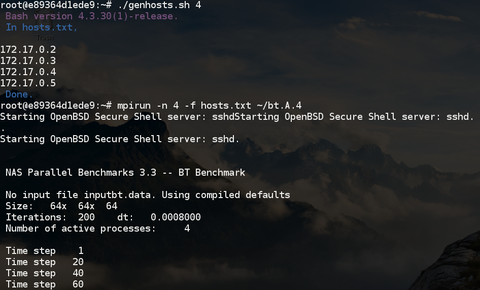

# Introduction
CLUSIM: A Fast and Scalable Trace-Driven Cluster Simulator  
Authors: Cheng-Yueh Liu, Po-Yao Huang 

# Prerequisite

## Ubuntu 16.04
`sudo apt-get install docker.io` 

## CentOS 7
`sudo yum install docker`


# How To Execute a Simple MPI Application on Virtual Container Cluster
## 1. Setup Docker
```
sudo systemctl enable docker
sudo systemctl start docker
```

## 2. Collect Network Traces from Docker Network Interface
```
tcpdump -i docker0 -w demo.pcap
```

## 3. Lauch a Docker Cluster and Run a MPI-application
```
cd clusim/examples
Download hpc_node.tar :  https://drive.google.com/file/d/0BwfK93g2BHz7N0FBRG9SQU1sMlE/view?usp=sharing    
sudo cat hpc_node.tar | sudo docker import - hpc/node 
./start-vcluster.sh 4 0
```
Then, we will log in to master node,  
```
./genhosts.txt 4
mpirun -f hosts.txt -n 4 ~/bt.A.4
```
### Snapshot of Demo 



## 4. Download, Build and Test NS-3
```
Step I:  
cd clusim
wget http://www.nsnam.org/release/ns-allinone-3.26.tar.bz2   
tar xjf ns-allinone-3.26.tar.bz2   
ln -s ns-allinone-3.26 ns3   

Step II:     
cd ns3   
./build.py --enable-examples --enable-tests   

Step III:      
cd ns-3.26   
./waf --run hello-simulator   
cp examples/tutorial/first.cc scratch/myfirst.cc   
./waf --run scratch/myfirst   
```

## 5. Using Clusim to Simulate and Analyze Network Performance
Modify the path to the logged pcap file in simple.cfg  
```
cd clusim  
make 
./clusim default.cfg 
```
